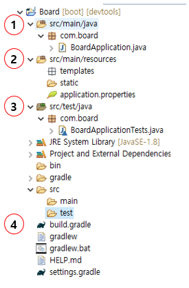

#  방문자 관리 시스템 개발 과정

### STS

1. STS(SpringSource Tool Suite)
    - 참고 URL
        - https://lifedeveloper.tistory.com/entry/STSSpringSource-Tool-Suite-%EB%9E%80
    - Spring 개발업체인 SpringSource가 직접 만들어 제공
    - Spring 개발에 최적화 되도록 만든 IDE
    - Maven 라이브러리 관리 + 빌드 툴 편리한 Dependency Library 관리
2. 빌드
    - 소스코드 파일을 컴퓨터에서 실행할 수 있는 독립 소프트웨어 가공물로 변환하는 과정 또는 그에 대한 결과물
    - 작성한 소스코드(java), 프로젝트에서 쓰인 각각의 파일 및 자원 등(.xml, .jpg, .jar, .properties)을 JVM이나 톰캣같은 WAS가 인식할 수 있는 구조로 패키징 하는 과정 및 결과물
3. 빌드도구
    - 프로젝트 생성, 테스트 빌드, 배포 등의 작업을 위한 프로그램
    - 초기의 java 빌드도구로 Ant를 많이 사용하였으나 최근 많은 빌드도구들이 생겨나 Maven이 많이 쓰였고, 현재는 Gradle이 많이 쓰임

### Spring Boot

1. 환경 설정 
    - 참고 URL
        - https://velog.io/@light/%EC%8A%A4%ED%94%84%EB%A7%81-%EB%B6%80%ED%8A%B8SpringBoot-1.%EC%8B%9C%EC%9E%91%ED%95%98%EA%B8%B0
        - [서버 시작 테스트](http://millky.com/@origoni/post/1100)
    - STS4 설치
    - 기본 설정
        - Preference 가서 Show heap status 설정
        (STS가 버벅거릴 때 메모리 정리 가능)
        - SpringToolSuite4.ini 파일에서 첫 번째 Xms를 원하는 메모리 크기로 변경 가능
        - UTF-8 설정
        - Web, Java EE 등 추가 설치
2. 시작하기
    - 참고 URL 
        - https://congsong.tistory.com/13?category=749196
    - port 변경
        - application.properties에 추가
            ```java
            server.port = [원하는 포트 번호]
            ```
    - jdbc 설정 전에 서버만 실행 테스트
        - Main Class에 어노테이션 추가 후 Import
            ```java
            @EnableAutoConfiguration(exclude={DataSourceAutoConfiguration.class})
            ```
    - 자동 리로드
        - spring-boot-devtools 추가 후 application.properties에 추가
            ```java
            spring.devtools.livereload.enabled=true
            ```
3. 프로젝트 구조
    
    1. src/main/java 디렉터리
        - 기존의 스프링 프로젝트와 마찬가지로 클래스, 인터페이스 등 자바 파일이 위치하는 디렉터리
    2. BoardApplication 클래스
        - com.board 패키지에는 우리가 생성하지 않은 BoardApplication 클래스가 포함
        - main 메서드는 SpringApplication.run 메서드를 호출해서 웹 애플리케이션을 실행하는 역할
        - 클래스 선언부에 선언된 @SpringBootAplication는 **3**가지 어노테이션으로 구성
            | 어노테이션 | 설명 |
            |:---|:---|
            @EnableAutoConfiguration | 스프링 부트는 개발에 필요한 몇 가지 필수적인 설정들의 처리가 되어 있음 (다양한 설정들 중 일부 자동 완료)
            @ComponentScan | 스프링 부트는 해당 어노테이션에 의해 자동으로 컴포넌트 클래스를 검색하고, 스프링 애플리케이션 콘텍스트(IoC 컨테이너)에 Bean으로 등록. 쉽게 이야기하면, 의존성 주입 과정이 더욱 간편해졌다고 생각할 수 있음 (기존의 XML 설정 방식의 스프링은 Bean의 등록 및 스캔을 위해 수동으로 ComponentScan을 여러 개 선언하는 방식을 사용)
            @Configuration | 해당 어노테이션이 선언된 클래스는 자바 기반의 설정 파일로 인식. 스프링 4 버전부터 자바 기반의 설정이 가능하게 되었으며, XML 설정에 어마 무시한 시간을 소모하지 않아도 됨.물론, XML 기반의 설정을 전혀 사용하지 않는 것은 아님.
    3. src/main/resources 디렉터리
        - 스프링은 프로젝트가 생성되면, 해당 디렉터리에 log4.xml 파일만 생성
        - 스프링 부트는 templates 폴더, static 폴더, application.properties 파일이 기본적으로 생성
        1. templates
            - 스프링 : HTML 내에 자바 코드를 삽입하는 방식의 JSP를 사용, 디렉터리의 위치도 웹 디렉터리에 해당하는 src/main/webapp 안에 존재
            (하지만, 이러한 방식은 war 파일로 패키지화되었을 경우에만 정적 리소스를 정상적으로 사용 가능)
            - 스프링 부트 : src/main/resources 디렉터리 내에서 화면과 관련된 파일을 관리하는 것 
            - 스프링 부트는 타임리프(Thymeleaf) 템플릿 엔진의 사용을 권장
            - 타임리프 : JSP와 마찬가지로 HTML 내에서 데이터를 처리하는 데 사용
        2. static
            - 해당 폴더에는 css, fonts, images, plugin, scripts 등의 정적 리소스 파일이 위치
        3. application.properties
            - 해당 파일은 웹 애플리케이션을 실행하면서 자동으로 로딩되는 파일
            - ex. 톰캣(Tomcat)과 같은 WAS(포트 번호, 콘텍스트 패스 등)의 설정이나,데이터베이스 관련 정보 등 각각으로 분리되어 있는 XML 또는 자바 기반의 설정을 해당 파일에 Key-Value 형식으로 지정해서 처리할 수 있음
    4. src/test/java 디렉터리
        - com.board 패키지에는 BoardApplicationTests 클래스가 생성, 해당 클래스를 이용해서 각각의 개발 단계에 알맞은 테스트를 진행 (기존의 스프링과 달리, 복잡한 설정 없이 곧바로 테스트가 가능)
    5. build.gradle
        - 스프링 : pom.xml에 여러 개의 dependency를 추가해서 라이브러리를 관리하는 방식의 메이븐(Maven) 사용
        (라이브러리의 버전 문제, 충돌 문제, 종속적인 문제 등 메이븐 사용 시 이슈 발생)
        - 메이븐 : 하나의 라이브러리를 추가하려면 평균적으로 네 줄 이상의 코드를 작성
        - 그레이들 : 단 한 줄의 코드로 라이브러리 추가 가능
        - 해당 파일에 추가한 라이브러리는 Project and External Dependencies에서 확인
4. DB 연결
    - 참고 URL
        - https://jung-max.github.io/2020/06/24/Web-3_SpringBoot-MariaDb%EC%97%B0%EA%B2%B0/
        - https://congsong.tistory.com/14?category=749196
        - https://earth-95.tistory.com/33
    -  gradle을 설정
    - src/main/resources에 있는 application.properties를 설정

5. MyBatipse
    - 이클립스 플러그인, 마켓에서 설치 가능
    - 특징
        - service 레이어에서 xml 쿼리문으로 바로 이동
        - xml 쿼리 작성시 class명 자동완성 기능
6. lombok
    - 참고 URL
        - https://dingue.tistory.com/14
        - 설치 필요
        https://goni9071.tistory.com/465
    - @Data 어노테이션은 하위 5개를 포함
        ```java
            @Getter
            @Setter
            @ToString
            @NoArgsConstructor
            @AllArgsConstructor
        ```
7. DAO, DTO, Service
    - 참고 URL
        - https://www.kurien.net/post/view/24
        - https://m.blog.naver.com/jysaa5/221751719334
        - https://berrrrr.github.io/programming/2019/11/03/dao-vo-do-dto/
        - https://dalpaeng00.tistory.com/83
    - DAO 대신에 Mapper 사용
8. 메세지 설정
    - 참고 URL 
        - https://badstorage.tistory.com/34s

### Mail 전송

1. Mail 전송
    - https://sundries-in-myidea.tistory.com/113
    - https://victorydntmd.tistory.com/342
    - https://kitty-geno.tistory.com/43


### Thymeleaf

1. 템플릿 엔진이란?
    - 참고 URL
        - https://velog.io/@jaeeeun93/%ED%83%80%EC%9E%84%EB%A6%AC%ED%94%84Thymeleaf%EC%97%90-%EB%8C%80%ED%95%B4%EC%84%9C-%EC%95%8C%EC%95%84%EB%B3%B4%EC%9E%90
    - 동적 컨텐츠를 생산하는 방법
    - 템플릿 양식과 특정 데이터 모델에 따른 입력 자료를 결합하여 결과 문서를 출력
    - 타임리프 
        - 비교적 최근에 만들어진 템플릿 엔진
        - 서버사이드 자바 템플릿 엔진의 한 종류
        - JSP와 달리 Servlet Code로 변환되지 않는다
        (servlet : https://gmlwjd9405.github.io/2018/11/04/servlet-vs-jsp.html)

2. 사용
    - 디펜던시 추가

3. Thymeleaf Layout Dialect 
    - gradle 추가
        - https://mvnrepository.com/artifact/nz.net.ultraq.thymeleaf/thymeleaf-layout-dialect/2.5.3
    - 사용 방법
        - https://amagrammer91.tistory.com/86
        - https://dev-jwblog.tistory.com/34
### Front
1. Date Picker
    - 부트스트랩 4 호환 적용
        - https://blog.edit.kr/entry/Bootstrap-4-%EB%8B%AC%EB%A0%A5-datetimepicker-Bootstrap-3%EB%B2%84%EC%A0%84-%EC%97%85%EA%B7%B8%EB%A0%88%EC%9D%B4%EB%93%9C-%EB%B2%84%EC%A0%84-%EC%9D%B8%EA%B8%B0-%EB%8B%AC%EB%A0%A5
        - https://getdatepicker.com/5-4/Usage/#using-locales
2. sts4 에디터 설정
    - 에디터에 js 에디터 사라쥠
        - https://html6.tistory.com/415
3. pagination
    - https://wiki.jjagu.com/?p=407
### Spring Security

1. Spring Security란?
    - 참고 URL
        - https://mangkyu.tistory.com/76
        - https://jeong-pro.tistory.com/205
        - 전체 설명
        https://jungeunlee95.github.io/java/2019/07/17/
        https://sjh836.tistory.com/1652-Spring-Security/
    - Spring 기반의 애플리케이션의 보안(인증과 권한, 인가 등)을 담당하는 스프링 하위 프레임워크

2. 패스워드 암호화와 저장
    - 참고 URL
        - https://st-lab.tistory.com/100
        - https://bamdule.tistory.com/53
    - 해싱 vs 암호화 (암호학적)
        - 해싱 : **단방향**, 복호화가 불가능
        - 암호화 : **양방향**, 복호화도 가능
3. 활용하여 로그인
    - 참고 URL
        - https://taesan94.tistory.com/109
        - https://velog.io/@ctp102/SpringBoot-Spring-Security-1
        - https://velog.io/@leyuri/Springboot-Security-2-%EC%8B%9C%ED%81%90%EB%A6%AC%ED%8B%B0-%EC%84%A4%EC%A0%95
        - dto & entity 구별
        https://bhsbhs235.github.io/springboot/2020/02/23/springsecurity.html
        - mapper 이용 
        https://taesan94.tistory.com/109
        https://gaemi606.tistory.com/entry/Spring-%EC%8A%A4%ED%94%84%EB%A7%81-%EC%8B%9C%ED%81%90%EB%A6%AC%ED%8B%B0Spring-Security-4-MyBatis%EC%9D%B4%EC%9A%A9-%EB%A1%9C%EA%B7%B8%EC%9D%B8
        - 따라하기
        https://shinsunyoung.tistory.com/78
        https://technology-share.tistory.com/20
        - 암호화 인코더 설정
        https://bhsbhs235.github.io/springboot/2020/02/23/springsecurity.html
        - message properties 설정
        https://shinsunyoung.tistory.com/79
        - 이해하기 쉬운 spring security
        https://postitforhooney.tistory.com/entry/SpringSecurity-%EC%B4%88%EB%B3%B4%EC%9E%90%EA%B0%80-%EC%9D%B4%ED%95%B4%ED%95%98%EB%8A%94-Spring-Security-%ED%8D%BC%EC%98%B4
        - spel 정리
        https://sarc.io/index.php/java/1857-spring-boot-security

### Javascript 비밀번호 암호화
1. SHA256
    - 참고 URL
        - https://dlagusgh1.tistory.com/375

### Maria DB

1. DBever
    - 참고 URL
        - https://goddaehee.tistory.com/202
        - https://post.naver.com/viewer/postView.nhn?volumeNo=26982618&memberNo=227705
    - 특징
        - 무료
        - 여러 DB(Oracle, MS-SQL, MySQL, PostgreSQL, MariaDB, 몽고 DB 등)의 접속 툴로 사용 가능
        - Windows, Mac OS (osX), Linux 의 환경에서 사용이 가능
    - 설치
        -  https://dbeaver.io/
2. MariaDB 설치
    - 참고 URL : https://offbyone.tistory.com/199
    - https://downloads.mariadb.org/


